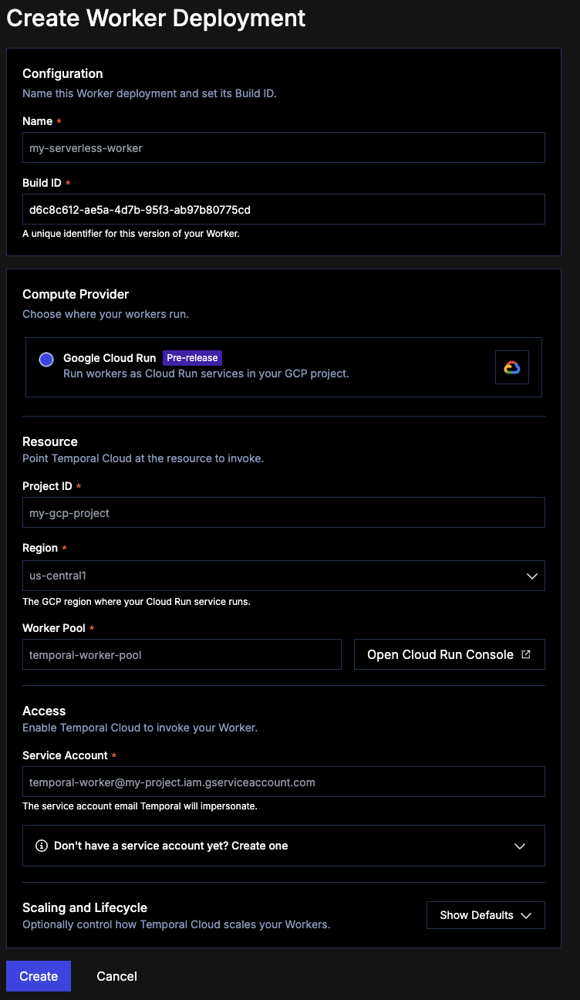

# Temporal GCP Cloud Run Demo

This repo illstrate how you can deploy your Temporal Workers to Google Cloud Run.

This code is based on the [samples-typescript/production](https://github.com/temporalio/samples-typescript/tree/main/production).

### Getting started

#### Prerequisite

You will need the following software:
- [Node](https://nodejs.org/en)
- [Temporal CLI](https://docs.temporal.io/cli)
- Optional:
    - [Docker](https://www.docker.com/)

For those devs using [Flox](http://flox.dev/), you can run:
```sh
flox activate
```

For those using [Nix](https://nixos.org/), you can run:
```sh
direnv allow
```

#### Local Testing without Docker

1. `cp temporal-example.toml temporal.toml` Copy the example .toml
1. `temporal server start-dev` to start [Temporal Server](https://github.com/temporalio/cli/#installation).
1. `npm install` to install dependencies.
1. `NODE_ENV=development TEMPORAL_PROFILE=default TEMPORAL_CONFIG_FILE=temporal.toml npm run start.watch` to start the Worker.
1. In another shell, `temporal worker deployment describe --name my-app` see the list of deployments.
1. `temporal worker deployment set-current-version --deployment-name my-app --build-id build-1` deploy this worker.
1. `npm run workflow` to run the Workflow.

The Workflow should return:

```
Hello, Temporal!
```

#### Running this sample in production

1. `npm run build` to build the Worker script and Activities code.
1. `npm run build:workflow` to build the Workflow code bundle.
1. `NODE_ENV=production node lib/worker.js` to run the production Worker.

### Local Testing with Docker

1. `docker compose up -d` to spin up the worker and Temporal.
1. `docker compose exec temporal temporal worker deployment describe --name my-app` see a list of deployements.
1. `docker compose exec temporal temporal worker deployment set-current-version --deployment-name my-app --build-id build-1` deploy the worker.

### Google Cloud

#### Prerequisite

In order to deploy this genius piece of code, you will need the following:
- [Google Cloud Account](https://cloud.google.com/)
    - [gcloud CLI](https://cloud.google.com/cli)
- [Terraform CLI](https://developer.hashicorp.com/terraform/cli/commands)


#### Getting Started with Google Cloud

##### Setting up your Google Cloud Project and Services

1. `gcloud auth login`
1. `gcloud projects create <PROJECT_ID>`
1. `gcloud config set project <PROJECT_ID>`
1. `gcloud config set run/region <REGION>`
1. `gcloud auth configure-docker <REGION>-docker.pkg.dev`
1. `gcloud services enable run.googleapis.com artifactregistry.googleapis.com cloudbuild.googleapis.com`

##### Builing, Deploying, and creating a Worker Pool

Set the following values:
```sh
export PROJECT=anthony-project-470414
export REGION=us-central1
export BUILD_ID=$(git rev-parse --short HEAD)
export REPO=temporal-gcp-cloud-run
export IMAGE=$REGION-docker.pkg.dev/$PROJECT/${REPO}/worker:$BUILD_ID
```

Create the Docker repo:
```sh
gcloud artifacts repositories create $REPO \
  --repository-format=docker \
  --location=$REGION \
  --description="Temporal worker images"
```
Verify it's been created:
```sh
gcloud artifacts repositories list --location=$REGION
```
Build and Deploy
```sh
docker build --platform linux/amd64 --build-arg BUILD_ID=$BUILD_ID -t $IMAGE .
docker push $IMAGE
```

Verify the image has been deployed.
```sh
gcloud artifacts docker images list $REGION-docker.pkg.dev/$PROJECT/$REPO/worker
```

Create a service account:
```sh
gcloud iam service-accounts create temporal-worker-pool-runner --display-name "Temporal Worker Pool Runner"

# Save the output as export RUNNER_SERVICE_ACCOUNT
```

Upload the Temporal API Key
```sh
gcloud services enable secretmanager.googleapis.com

printf %s "$TEMPORAL_API_KEY" | gcloud secrets create temporal-api-key \
  --data-file=- \
  --replication-policy=automatic
```

Grant the runner access to the API Key
```sh
gcloud secrets add-iam-policy-binding temporal-api-key \
  --member="serviceAccount:temporal-worker-pool-runner@$PROJECT.iam.gserviceaccount.com" \
  --role="roles/secretmanager.secretAccessor"
```

Create a worker pool
```sh
gcloud run worker-pools deploy worker-pool-$BUILD_ID \
  --image $IMAGE \
  --region $REGION \
  --service-account $RUNNER_SERVICE_ACCOUNT \
  --memory 1Gi \
  --set-env-vars NODE_OPTIONS=--max-old-space-size=819,TEMPORAL_PROFILE=production,TEMPORAL_TASK_QUEUE=production-sample \
  --set-secrets TEMPORAL_API_KEY=temporal-api-key:latest \
  --instances 0
```

Go to the Temporal Cloud UI and Create a Worker Deployment



After you run those terraform commands, save the invoker email as `RUNNER_SERVICE_ACCOUNT`

##### Deploying Changes and Versioning

Follow these steps when you make local changes to your Temporal Worker, Workflow, and Activity and you want to deploy it to Google Cloud.

Rebuild the Image 
```sh
docker build --platform linux/amd64 --build-arg BUILD_ID=$BUILD_ID -t $IMAGE .
```

Deploy it to GCP
```sh
docker push $IMAGE
```

Create a new set of worker pool
```sh
gcloud run worker-pools deploy worker-pool-$BUILD_ID \
  --image $IMAGE --region $REGION \
  --service-account $RUNNER_SERVICE_ACCOUNT \
  --memory 1Gi \
  --set-env-vars NODE_OPTIONS=--max-old-space-size=819,TEMPORAL_PROFILE=production,TEMPORAL_TASK_QUEUE=production-sample \
  --set-secrets TEMPORAL_API_KEY=temporal-api-key:latest \
  --instances 0
```

Create a new worker deployment
```sh
temporal worker deployment create-version \
    --namespace $NAMESPACE \
    --address $ADDRESS \ 
    --deployment-name $DEPLOYMENT \
    --build-id $BUILD_ID \
    --gcp-cloud-run-project $PROJECT \
    --gcp-cloud-run-region $REGION \
    --gcp-cloud-run-worker-pool worker-pool-$BUILD_ID \
    --gcp-cloud-run-service-account $RUNNER_SERVICE_ACCOUNT \
    --gcp-cloud-run-min-instances 0 \
    --gcp-cloud-run-max-instances 3 \
    --gcp-cloud-run-initial-instances 1 \
    --gcp-cloud-run-utilization-target 0.75 \
    --api-key $TEMPORAL_API_KEY
```

### Resources 
- [Deploy a Serverless Worker on GCP Cloud Run](https://docs.temporal.io/production-deployment/worker-deployments/serverless-workers/cloud-run)