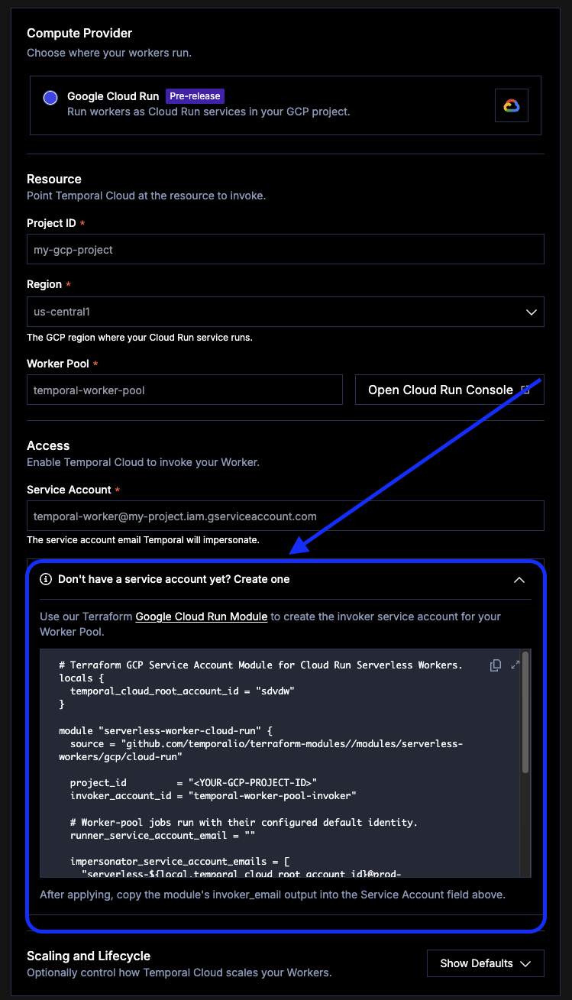

# Temporal GCP Cloud Run Demo

This repo illustrates how to deploy Temporal Workers to Google Cloud Run Worker Pools, using [Worker Versioning](https://docs.temporal.io/production-deployment/worker-deployments/worker-versioning) and profile-based [environment configuration](https://docs.temporal.io/develop/environment-configuration).

Based on [samples-typescript/production](https://github.com/temporalio/samples-typescript/tree/main/production).

## How configuration works

The Worker reads its connection settings from a TOML file, selected by profile:

| Profile | Address | Used by |
| --- | --- | --- |
| `default` | `localhost:7233` | Local dev, outside Docker |
| `preview` | `temporal:7233` | Docker Compose |
| `production` | `<namespace>.<account>.tmprl.cloud:7233` | Temporal Cloud / GCP |

Environment variables **always override** the TOML file. That's deliberate:

- `temporal.toml` holds non-secret values (address, namespace) and is baked into the image.
- `TEMPORAL_API_KEY` arrives at runtime from Secret Manager and fills in over the profile.

Because of that precedence, do **not** set `TEMPORAL_ADDRESS` or `TEMPORAL_NAMESPACE` anywhere — they would silently bypass the profile.

## Getting started

### Prerequisites

- [Node](https://nodejs.org/en) 24+
- [Temporal CLI](https://docs.temporal.io/cli)
- Optional: [Docker](https://www.docker.com/)

For [Flox](http://flox.dev/) users:

```sh
flox activate
```

For [Nix](https://nixos.org/) users:

```sh
direnv allow
```

**Required for every path below.** `temporal.toml` is gitignored, so create it from the example before running anything — including `docker compose`, which fails at the `COPY temporal.toml step without
it:

```sh
cp temporal-example.toml temporal.toml
```

Then fill in the `[profile.production]` address and namespace if you're deploying to Temporal Cloud.
Both are on the **Namespaces** tab of the Cloud UI. Leave the API key out of this file.

### Local testing without Docker

1. `temporal server start-dev` to start the [dev server](https://github.com/temporalio/cli/#installation).
1. `npm install` to install dependencies.
1. `NODE_ENV=development TEMPORAL_PROFILE=default TEMPORAL_CONFIG_FILE=temporal.toml npm run start.watch` Start the Worker:
1. In another shell, `temporal worker deployment describe --name my-app` to see the deployment.
1. `temporal worker deployment set-current-version --deployment-name my-app --build-id build-1 --yes`
1. `npm run workflow` to run the Workflow.

The Workflow should return:

```
Hello, Temporal!
```

### Local testing with Docker

1. `docker compose up -d` to spin up the Worker and Temporal.
1. `docker compose exec temporal temporal worker deployment describe --name my-app`
1. ```sh
   docker compose exec temporal temporal worker deployment set-current-version \
     --deployment-name my-app --build-id build-1 --yes```
1. `TEMPORAL_PROFILE=default TEMPORAL_CONFIG_FILE=temporal.toml npm run workflow` from the host, to
   start a Workflow against the containerized Worker.

### Running in production locally

1. `npm run build` to build the Worker and Activities.
1. `npm run build:workflow` to build the Workflow bundle.
1. `NODE_ENV=production TEMPORAL_CONFIG_FILE=temporal.toml node lib/worker.js`

## Google Cloud

### Prerequisites

- [Google Cloud account](https://cloud.google.com/) and the [gcloud CLI](https://cloud.google.com/sdk/docs/install)
- [Terraform CLI](https://developer.hashicorp.com/terraform/cli/commands)
- A Temporal Cloud account with a **GCP-hosted** namespace (the namespace's cloud provider must match
  the compute provider) and an API key — Cloud UI → **Settings → API Keys**, or
  `temporal cloud apikey create`. Create it against a Service Account rather than your user.

> **Install note:** if `gcloud run worker-pools` fails with `No module named 'grpc'`, you have the
> Homebrew cask, which uses system Python and can't install components. Replace it with the official
> tarball (`curl https://sdk.cloud.google.com | bash`), which bundles its own Python.

### 1. Set up the project

```sh
gcloud auth login
gcloud projects create <PROJECT_ID>
gcloud config set project <PROJECT_ID>
gcloud config set run/region <REGION>
gcloud services enable \
  run.googleapis.com \
  artifactregistry.googleapis.com \
  cloudbuild.googleapis.com \
  secretmanager.googleapis.com
```

### 2. Set your variables

```sh
export PROJECT=<PROJECT_ID>
export REGION=us-central1
export REPO=temporal-gcp-cloud-run
export BUILD_ID=$(git rev-parse --short HEAD)
export IMAGE=$REGION-docker.pkg.dev/$PROJECT/$REPO/worker:$BUILD_ID

# Temporal Cloud — from the Namespaces tab
export NAMESPACE=<namespace_id>.<account_id>
export ADDRESS=$NAMESPACE.tmprl.cloud:7233
export DEPLOYMENT=my-app
export TEMPORAL_API_KEY=<your API key>
```

### 3. Create the Artifact Registry repository

```sh
gcloud artifacts repositories create $REPO \
  --repository-format=docker \
  --location=$REGION \
  --description="Temporal worker images"

gcloud artifacts repositories list --location=$REGION
gcloud auth configure-docker $REGION-docker.pkg.dev
```
### 4. Build and push

```sh
docker build --platform linux/amd64 --build-arg BUILD_ID=$BUILD_ID -t $IMAGE .
docker push $IMAGE
```

### 5. Create the runner service account

Two service accounts are involved and **they are not interchangeable**:

| Account | Role |
| --- | --- |
| **Runner** | The identity the Worker Pool *runs as*. Needs read access to the API key secret. |
| **Invoker** | The identity Temporal Cloud *impersonates* to scale the pool. Created by Terraform in step 7. |

```sh
gcloud iam service-accounts create temporal-worker-pool-runner \
  --display-name "Temporal Worker Pool Runner"
```

### 6. Store the Temporal API key

```sh
printf %s "$TEMPORAL_API_KEY" | gcloud secrets create temporal-api-key \
  --data-file=- \
  --replication-policy=automatic

gcloud secrets add-iam-policy-binding temporal-api-key \
  --member="serviceAccount:$RUNNER_SERVICE_ACCOUNT" \
  --role="roles/secretmanager.secretAccessor"
```

When API keys expire, here is how you can rotate it:
`printf %s "$NEW_KEY" | gcloud secrets versions add temporal-api-key --data-file=-`, 
then redeploy the pool so running instances pick it up.

### 7. Grant Temporal permission to scale the pool



In the Temporal Cloud UI, **Workers → Create Worker Deployment → Access** provides a Terraform template with `impersonator_service_account_emails` pre-filled for your account. Copy it into `terraform/main.tf`.

```hcl
module "serverless-worker-cloud-run" {
  source = "github.com/temporalio/terraform-modules//modules/serverless-workers/gcp/cloud-run"

  project_id         = "<PROJECT_ID>"
  invoker_account_id = "temporal-worker-pool-invoker"

  impersonator_service_account_emails = [
    "<provided by Temporal Cloud>",
  ]

  runner_service_account_email = "temporal-worker-pool-runner@<PROJECT_ID>.iam.gserviceaccount.com"
}

output "invoker_email" {
  value = module.serverless-worker-cloud-run.invoker_email
}
```

And `terraform/provider.tf`:

```hcl
provider "google" {
  project = "<PROJECT_ID>"
  region  = "us-central1"
}
```

Don't add a `required_providers` version constraint here. The module pins `~> 4.0`, and a conflicting
root constraint fails with `no available releases match the given constraints`.

Terraform needs Application Default Credentials, which are **separate** from `gcloud auth login`:

```sh
gcloud auth application-default login
gcloud auth application-default set-quota-project <PROJECT_ID>

cd terraform
terraform init
terraform plan          # read this before applying — it's the trust grant to Temporal Cloud
terraform apply
terraform output -raw invoker_email
```

Setting `runner_service_account_email` matters: it grants the invoker `roles/iam.serviceAccountUser` on
your runner account, which Cloud Run requires to attach that identity when scaling. Omit it and the
grant lands on the default Compute Engine account instead.

This step is **per-project, not per-deploy**. You don't re-run Terraform for each release.

### 8. Create the Worker Pool

```sh
gcloud run worker-pools deploy worker-pool-$BUILD_ID \
  --image $IMAGE \
  --region $REGION \
  --service-account $RUNNER_SERVICE_ACCOUNT \
  --memory 1Gi \
  --set-env-vars NODE_OPTIONS=--max-old-space-size=819,TEMPORAL_PROFILE=production,TEMPORAL_TASK_QUEUE=production-sample \
  --set-secrets TEMPORAL_API_KEY=temporal-api-key:latest \
  --instances 0
```

### 9. Create the Worker Deployment Version

```sh
temporal worker deployment create-version \
  --namespace $NAMESPACE \
  --address $ADDRESS \
  --api-key $TEMPORAL_API_KEY \
  --deployment-name $DEPLOYMENT \
  --build-id $BUILD_ID \
  --gcp-cloud-run-project $PROJECT \
  --gcp-cloud-run-region $REGION \
  --gcp-cloud-run-worker-pool worker-pool-$BUILD_ID \
  --gcp-cloud-run-service-account $INVOKER_SERVICE_ACCOUNT \
  --gcp-cloud-run-min-instances 0 \
  --gcp-cloud-run-max-instances 3 \
  --gcp-cloud-run-initial-instances 1 \
  --gcp-cloud-run-utilization-target 0.75
```

`--gcp-cloud-run-service-account` takes the **invoker** account, not the runner. `--deployment-name`
and `--build-id` must match what the Worker announces in `workerDeploymentOptions`.

Equivalent to the Cloud UI form:


Verify with **Workers → Deployments →** your deployment **→ Actions → Validate Connection**.

### 10. Set the version as current

```sh
temporal worker deployment set-current-version \
  --namespace $NAMESPACE \
  --address $ADDRESS \
  --api-key $TEMPORAL_API_KEY \
  --deployment-name $DEPLOYMENT \
  --build-id $BUILD_ID \
  --yes
```

### 11. Verify

```sh
temporal workflow start \
  --namespace $NAMESPACE --address $ADDRESS --api-key $TEMPORAL_API_KEY \
  --task-queue production-sample \
  --type example \
  --input '"Hello, serverless!"'

gcloud run worker-pools logs read worker-pool-$BUILD_ID --region $REGION
```

## Deploying changes

Steps 1–7 are one-time. Each release is:

```sh
git commit -am "..."                                  # BUILD_ID comes from the commit
export BUILD_ID=$(git rev-parse --short HEAD)
export IMAGE=$REGION-docker.pkg.dev/$PROJECT/$REPO/worker:$BUILD_ID

docker build --platform linux/amd64 --build-arg BUILD_ID=$BUILD_ID -t $IMAGE .
docker push $IMAGE

gcloud run worker-pools deploy worker-pool-$BUILD_ID \
  --image $IMAGE --region $REGION \
  --service-account $RUNNER_SERVICE_ACCOUNT \
  --memory 1Gi \
  --set-env-vars NODE_OPTIONS=--max-old-space-size=819,TEMPORAL_PROFILE=production,TEMPORAL_TASK_QUEUE=production-sample \
  --set-secrets TEMPORAL_API_KEY=temporal-api-key:latest \
  --instances 0

temporal worker deployment create-version --namespace $NAMESPACE --address $ADDRESS \
  --api-key $TEMPORAL_API_KEY --deployment-name $DEPLOYMENT --build-id $BUILD_ID \
  --gcp-cloud-run-project $PROJECT --gcp-cloud-run-region $REGION \
  --gcp-cloud-run-worker-pool worker-pool-$BUILD_ID \
  --gcp-cloud-run-service-account $INVOKER_SERVICE_ACCOUNT

temporal worker deployment set-current-version --namespace $NAMESPACE --address $ADDRESS \
  --api-key $TEMPORAL_API_KEY --deployment-name $DEPLOYMENT --build-id $BUILD_ID --yes
```

Deploy **before** promoting. Promote a version whose pool isn't polling yet and new Workflows stall.

Every code change needs a new build ID. Under `PINNED`, running executions replay against the exact code they started with, so reusing a build ID for different code produces non-determinism errors.

### Cleanup

```sh
gcloud run worker-pools list --region $REGION
gcloud run worker-pools delete worker-pool-<old-build-id> --region $REGION
```

Version states tell you when it's safe: *Current* receives new Workflows, *Inactive* has polled but receives nothing, *Drained* was Current and has no running executions left. Delete a pool only once its version is Drained — deleting earlier strands pinned Workflows. There's a per-deployment version limit, so this isn't optional indefinitely.

## Resources

- [Deploy a Serverless Worker on GCP Cloud Run](https://docs.temporal.io/production-deployment/worker-deployments/serverless-workers/cloud-run)
- [Worker Versioning](https://docs.temporal.io/production-deployment/worker-deployments/worker-versioning)
- [Environment configuration](https://docs.temporal.io/develop/environment-configuration)
- [Run a Worker on Docker](https://docs.temporal.io/develop/typescript/workers/run-worker-process#run-a-worker-on-docker)